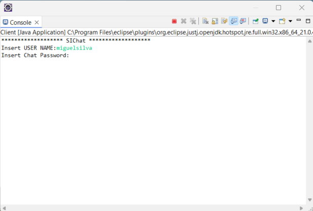
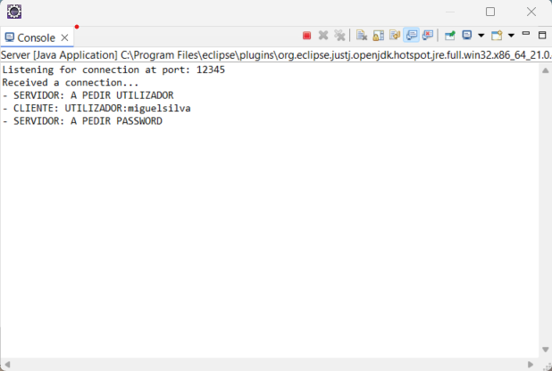
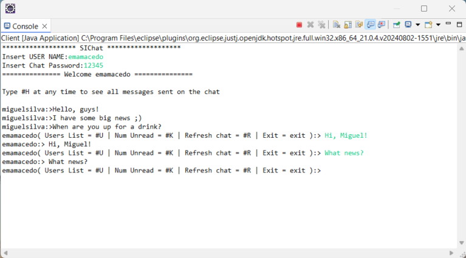
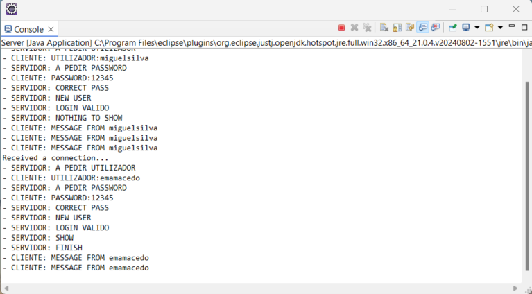
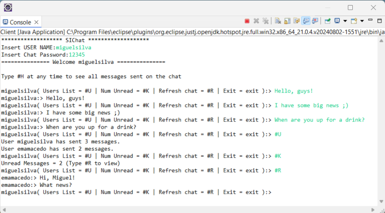
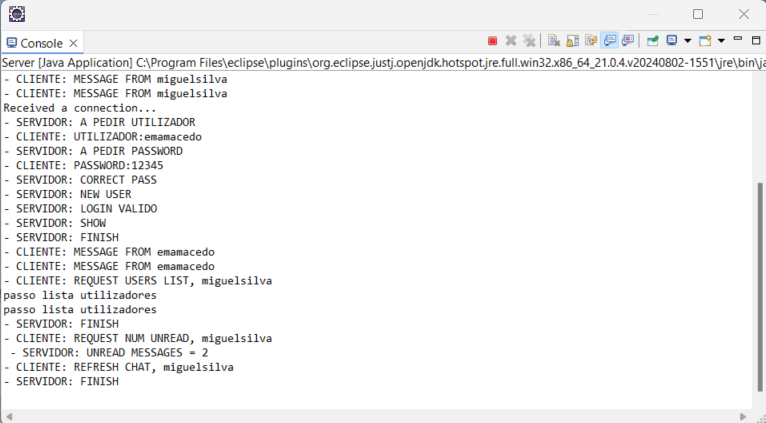
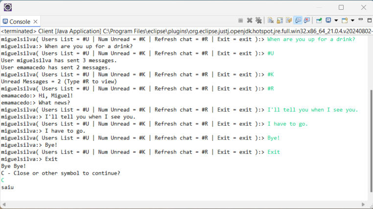
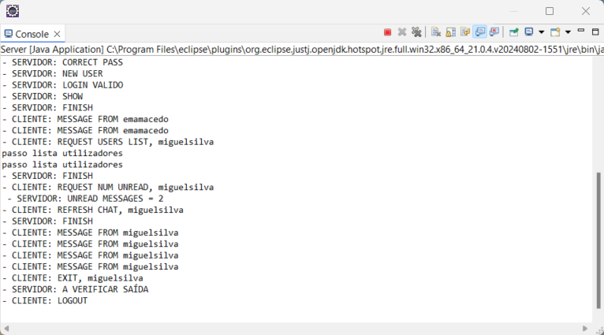

# Multi User Chat 

This project is a distributed chat application developed in Java for Informatics Systems class, allowing multiple users to communicate in a shared chat environment.

Each user enters the chat by providing a unique username and a common chat password (shared among all users). The server operates in an infinite loop, waiting for new TCP connections from clients. Each client that connects to the server can communicate using the established protocol, which supports multiple users simultaneously through multi-threading.

**Connection Process:**
- Clients initiate a connection by sending their username and chat password.
- If the password is valid and the client is not already connected, the server accepts the request.
- The server maintains a list of users who are currently or have been connected to the chat.

**User Capabilities:**

Once connected, users can:

- Send messages to the chat
- Check for unread messages from other users and view them
- List currently connected users and the number of messages each has sent
- Exit the chat

**Output Examples:**

 
 
 
 

